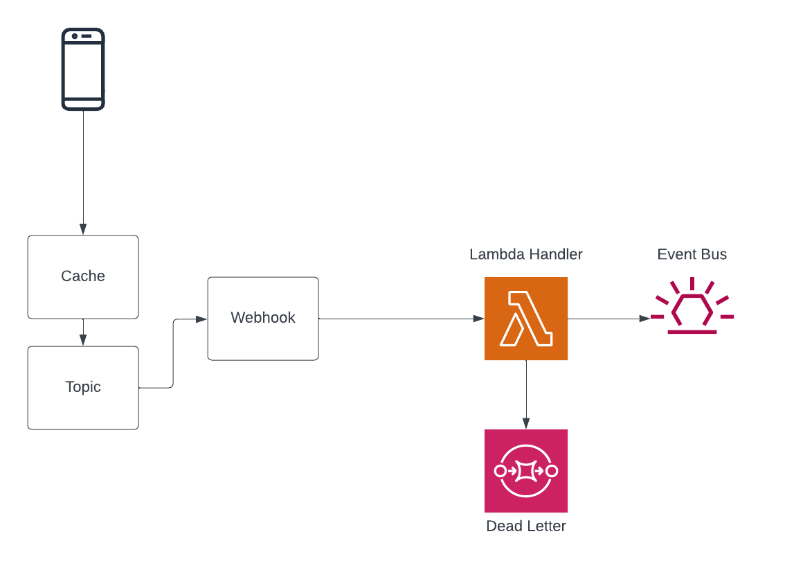

## Momento Webhook Handler

### Purpose

This repository contains 3 distinct assets that deliver a final output of an AWS Lambda that can be invoked by a FunctionURL
from a Momento Webhook in a one-click CloudFormation Template deployment into a user's AWS Account

### Distinct Artifacts

-   bucket-infra: Holds the TypeScript CDK code that builds the S3 Buckets that hold the finalized Webhook Lambda zip bundle. The buckets are used by Momento and the source bucket is replicated to multiple regions to support the deployment of the handler in those supported locations
-   template.yaml: This is the one-click template that deploys the handler in the region and account of the user's choosing. It will appear in documentation like this 
-   src: This is the Webhook Handler's source code that handles the invocation from Momento and puts an event on the EventBridge Bus of the user's choosing.

### Deploying Momento Buckets

#### Dependencies

-   Node.js: [Install Node](https://nodejs.org/en/download)
-   AWS CDK: `npm install aws-cdk-lib`

```bash
cd bucket-infra
npm i
# this deploys the buckets in all regions defined in bin/app.ts and setups
# up proper replication from the source bucket in the us-west-2 region
cdk deploy --all
```

### Deploying the Template

The primary bucket defined in the above CDK code will be deployed in `us-west-2`. Log into the AWS Console in that region, and copy the `template.yaml` file from this repository into that bucket.

### Deploying the Webhook Handler



#### Dependencies

-   Rust: [Install Rust](https://www.rust-lang.org/tools/install)
-   Cargo Lambda: [Install Cargo Lambda](https://www.cargo-lambda.info/guide/installation.html)

```bash
# build the Lambda
#   - release mode
#   - arm arch for graviton
#   - bundle as a zip package
cargo lambda build --arm64 --release  --output-format zip
```

#### Upload

Open the Console in the account where the above buckets were created. Navigate to S3 and locate the `us-west-2-momento-webhook-bucket`

Copy `target/lambda/momento-webhook-handler/bootstrap.zip` into the root of the bucket and give it a few minutes to replicate to the other regions.

DONE!
